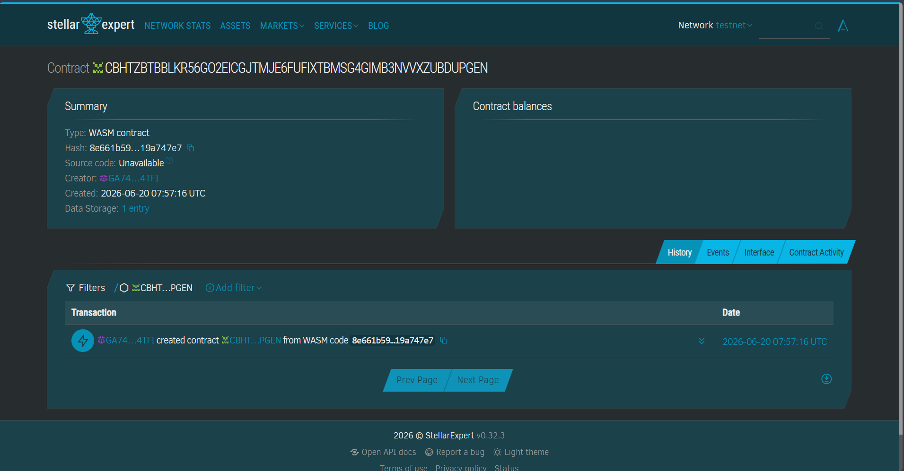

# COD Lock

> Trustless cash-on-delivery escrow on Stellar — buyers prepay into a smart contract, sellers get paid the moment delivery is confirmed, and money auto-returns if the parcel bounces back.

## Project Description

COD Lock is a Soroban smart contract on Stellar that escrows cash-on-delivery (COD) orders for Filipino social-commerce sellers. A buyer prepays an order into the contract; the funds stay neutral while the parcel is in transit and can only move in one of two directions — released to the seller once delivery is confirmed, or refunded to the buyer if the parcel is returned. The project ships with the on-chain contract (`create_order`, `confirm_delivery`, `refund_order`, `get_order`), a 5-test suite, and a Vite + React Freighter wallet front-end (in [`web/`](web/)) for connecting a wallet, viewing a Testnet XLM balance, and sending payments.

## Problem

Joy, a Facebook-page clothing seller in Manila, ships cash-on-delivery parcels through couriers like J&T and loses roughly ₱4,000/week to fake orders and "rejected on delivery" buyers — she has already paid for courier and packaging before learning the order was bogus.

## Solution

The buyer prepays the order into a Soroban escrow at checkout. The contract releases USDC to the seller the instant delivery is confirmed, and refunds the buyer if the parcel is returned — settling in ~5 seconds for sub-cent fees, with no bank or middleman holding the money.

## Works on weak signal (offline options)

Many Philippine sellers and buyers are in low-connectivity areas, so the app ships an **Emergency** view with two fallbacks a customer can use when data is weak or down:

- **Pay at a counter (agent model).** The customer brings cash and an order code to a nearby COD Lock counter — a sari-sari store or padala agent — who locks the money in escrow for them. Mirrors how OFW remittance counters already work; needs no new tech, just people + incentives.
- **Pay by text (SMS/USSD).** The customer dials a short code (e.g. `*123*456#`) to confirm an order from any basic phone with no data — the M-Pesa pattern. The app includes a working preview of this flow; a production version connects to a telco / SMS gateway (next-phase backend).

The app itself is also a static, cache-friendly build, so the UI and the practice demo load on a single bar of signal. The one thing that always needs a moment of connectivity is broadcasting the signed transaction to the Stellar network — no blockchain can settle fully offline.

## Timeline (bootcamp-scoped)

- **Day 1** — Contract: `create_order`, `confirm_delivery`, `refund_order`, `get_order`.
- **Day 2** — Tests (5) + deploy to Stellar testnet, mint a test USDC asset.
- **Day 3** — Minimal Freighter web flow ("pay-to-order" link) + record the < 2-minute demo.

## Stellar features used

- **USDC transfers** via the Stellar Asset Contract (token interface)
- **Soroban smart contracts** for the escrow state machine
- **Trustlines** so the buyer/seller hold the USDC asset

## Vision and Purpose

Cash-on-delivery dominates Philippine social commerce precisely because buyers and sellers don't trust each other — yet that same distrust drains small sellers through fraud and rejected parcels. COD Lock replaces "trust the stranger" with "trust the contract": funds are committed up front, neutral while in transit, and can only move to the seller (delivered) or back to the buyer (returned). The purpose is to make small online sellers whole and let buyers prepay strangers safely — using Stellar's near-zero fees so escrowing even a ₱500 order is economical.

## Prerequisites

- **Rust** (stable) with the Wasm target:
  ```bash
  rustup target add wasm32-unknown-unknown
  ```
- **Stellar CLI** (the `soroban` CLI was renamed to `stellar`):
  ```bash
  cargo install --locked stellar-cli
  ```
- **Freighter wallet** browser extension, set to **Testnet**.

## Build

```bash
stellar contract build
# equivalent to:
# cargo build --target wasm32-unknown-unknown --release
```

The Wasm artifact is written to `target/wasm32-unknown-unknown/release/cod_lock.wasm`.

## Test

```bash
cargo test
```

Runs all 5 tests: happy path, edge case (double-confirm rejected), state verification, refund flow, and order isolation.

## Deploy to testnet

```bash
# 1. Create and fund a testnet identity
stellar keys generate --global my-key --network testnet
stellar keys fund my-key --network testnet

# 2. Deploy the contract
stellar contract deploy \
  --wasm target/wasm32-unknown-unknown/release/cod_lock.wasm \
  --source my-key \
  --network testnet
# -> prints the deployed CONTRACT_ID
```

## Deployed Contract Details

- **Network:** Stellar Testnet
- **Contract ID:** `CBHTZBTBBLKR56GO2EICGJTMJE6FUFIXTBMSG4GIMB3NVVXZUBDUPGEN`
- **Explorer:** https://stellar.expert/explorer/testnet/contract/CBHTZBTBBLKR56GO2EICGJTMJE6FUFIXTBMSG4GIMB3NVVXZUBDUPGEN



## Sample CLI invocation (the MVP function)

Fund a new escrow order for 500 USDC units (replace the dummy ids with real addresses):

```bash
stellar contract invoke \
  --id CBHTZBTBBLKR56GO2EICGJTMJE6FUFIXTBMSG4GIMB3NVVXZUBDUPGEN \
  --source my-key \
  --network testnet \
  -- \
  create_order \
  --buyer  GBUYER...DUMMY \
  --seller GSELLER...DUMMY \
  --token  CUSDC...SAC_ADDRESS \
  --amount 500
# -> returns the new order id (e.g. 1)

# Then confirm delivery to release funds to the seller:
stellar contract invoke --id CBHTZBTBBLKR56GO2EICGJTMJE6FUFIXTBMSG4GIMB3NVVXZUBDUPGEN --source my-key --network testnet \
  -- confirm_delivery --order_id 1
```

## License

MIT — see below.

```
MIT License

Copyright (c) 2026 Quest Construction

Permission is hereby granted, free of charge, to any person obtaining a copy
of this software and associated documentation files (the "Software"), to deal
in the Software without restriction, including without limitation the rights
to use, copy, modify, merge, publish, distribute, sublicense, and/or sell
copies of the Software, and to permit persons to whom the Software is
furnished to do so, subject to the following conditions:

The above copyright notice and this permission notice shall be included in all
copies or substantial portions of the Software.

THE SOFTWARE IS PROVIDED "AS IS", WITHOUT WARRANTY OF ANY KIND, EXPRESS OR
IMPLIED, INCLUDING BUT NOT LIMITED TO THE WARRANTIES OF MERCHANTABILITY,
FITNESS FOR A PARTICULAR PURPOSE AND NONINFRINGEMENT. IN NO EVENT SHALL THE
AUTHORS OR COPYRIGHT HOLDERS BE LIABLE FOR ANY CLAIM, DAMAGES OR OTHER
LIABILITY, WHETHER IN AN ACTION OF CONTRACT, TORT OR OTHERWISE, ARISING FROM,
OUT OF OR IN CONNECTION WITH THE SOFTWARE OR THE USE OR OTHER DEALINGS IN THE
SOFTWARE.
```
